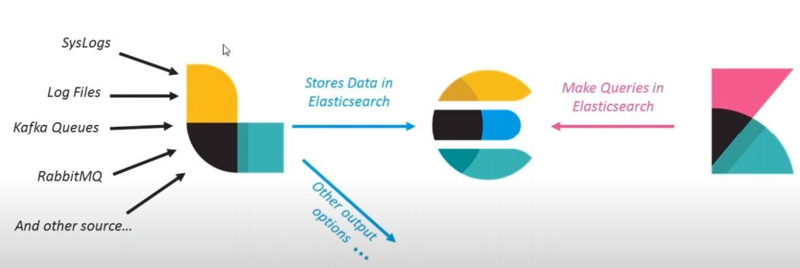

# Kibana Note

## Introduction

Kibana is an browser based visualization tool that helps manage Elastc Stack.
Usually, Kibana is used in ELK(Elasticsearch, Logstash, Kibana) stack, which enable
users to collect, store and analyse log data from a set of applications.



### Role of Kibana in ELK

* Searching & interaction with Data in Elasticsearch
* Advanced analytics & creation of reports
* Creation & sharing of dynamic dashboards that get updated in realtime

## CRUD towards Elasticsearch

Kibana offers powerful GUI for search and analyse data in ES, while you can also manipulate ES through in DevTool through REST APIs of ES.

### Discover - GUI

To leverage the tool, you need to create an index pattern at first. You can either or not impose a time filter on it.

### Query

By defaulst, we can use Kibana's standard query language.

`<field> : <value>`

You can also use `and`, `or` to complete more complicated query.

After hit apply, the most recent matched documents be included. The default size is 500, and you can use set the `discover:sampleSize` in Advanced Setting.

You can save the search result by click the save above tool bar.

You can save the query by click the `#` in the front of the tool bar. This query can be loaded later for  further modification or usage.

As more documents are added to the indices while you are searchng, you search result may get stale. In this case, you can configure a refresh rate to resubmit request periodically.

### DevTool - CLI

#### Console

There is a Console in the DevTool, which enables you to interact with REST API of Elasticsearch:

* Send requests to Elasitcsearch and view the responses
* View API documentation
* Get request history

The console has autocomplete and auto-formatting features. The former feature can speed up your query speed, while the later one can imporve your request's readability. Here are some examples:

```json
# Search data with gateway timestamp and S3Path
GET data/_search/
{
  "query": {
    "bool": {
      "must": [
        {
          "exists": {
            "field": "gatewayTimeStamp"
          }
        },
        {
          "exists": {
            "field": "s3Path"
          }
        }
      ]
    }
  }
}
```

```json
POST data/_update/<id>
{
    "doc" : {
        "gatewayTimeStamp" : <Timestamp>
    }
}
```

#### Profiling

This tool work with Elasticsearch's Profile API, which can be used to inspect and analyze the search query to diagnose and debug poorly performing queries much faster.

## Visualization Samples
