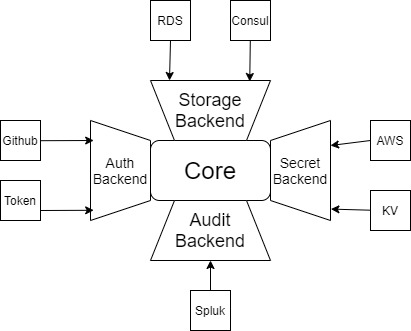

# Vault

Vault is a tool for securely accessing secrets. It has a bunch of useful feature for managing secrets.

## Motivation

### Sprawl of Secret

A modern system requires access to a multitude of secrets, such as database credentials, API keys for external services, credentials for service-oriented architecture communication. As the system scale up, it is difficult to manage those secrets as they are spread in every corner. And it also hard to manage the access towards secrets or keep a detailed audit log, or even more complicated, how to rotate the secrets.

Solution from Vault:

1. Centralize secrets: Keep all the secrets in Vault, stored in the storage engine. All the secrets are encrypts before being stored.
2. Access Control: Assign proper role for each application to control their access towards secrets.
3. Audit trail: Keep track of which role has accessed which secret, better visibility.

### Indicator of Compromise

Usually, application does not well on maintaining the secrets, which suffers risk of leakage. Moreover, we have no idea where the compromise could happen.

Solution from Vault:

1. Dynamic secrets: Ephemeral keys with certain duration.
2. Unique credential: Assign unique credential for each application, so that if any compromise detected, we can pinpoint corresponding applications.
3. Revoke as needed

### Encrypt as Service

Application may store thier own confidential data that shoud be encrypted. While encryption algorithms is difficult to implemented and there are a lot of subtle nuances that exposes vulnerabilities to outside.

Solution from Vault:

1. Named Key
2. High Level Api: Encrypt/Decrypt

  

## HSDP Vault

Currently, HSDP Vault broker offers Vault service with basic functionalities:

1. Key-value Secret Storage
2. Key Management System: Encrypt/Decrypt, Sign/Verify

## Reference

* [HSDP Vault Service Broker](https://www.hsdp.io/documentation/vault-service-broker)
* [Vault Official Document](https://www.vaultproject.io/docs)
* [Vault Official API Document](https://www.vaultproject.io/api-docs)
* [Vault Get Started](https://learn.hashicorp.com/vault/getting-started/install)
