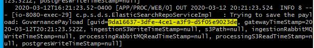
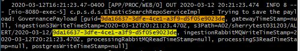

# DataGovernance Sync Up Meeting 

`2020 Mar 13`

## 1 Current State

* Implemented upsert to replace 

* Tested with low volume data flow from FocalPoint
  * Successfully receive data from other microservice
  * Wrtie given governance payload without conflict

* Working on test backfill

## 2 Issues

* Lost Update
  
  Timestamp: 23.524-23.588
  
  Timestamp: 23.474-23.520
  
  Timestamp: 23.531-23/588